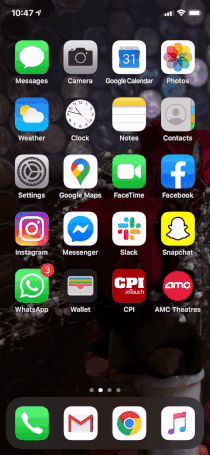
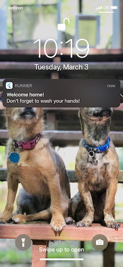

# flutter-clean-hands

A Flutter application demonstrating local notifications based on geolocation/geofencing

Its purpose is to remind users to wash their hands when they arrive home. The user enters in their home location into the application. A geofence is added with those coordinates and the location is saved into Shared Preferences for persistence. Whenever the user **enters** into the geofence, they will receive a notification to wash their hands! The user can go into the application and update their home location any time. The geofence for the previous home location is replaced with the geofence for the new location.





## Getting Started

**Note:** This has only been tested on iOS simulators and iOS real devices.

Prerequisites:
- [Flutter](https://flutter.dev/docs/get-started/install)
- [Platform setup](https://flutter.dev/docs/get-started/install/macos#platform-setup) - Android/iOS
- [Google Cloud API Key](https://developers.google.com/maps/documentation/ios-sdk/get-api-key)

Replace line 16 in *lib/main.dart* with your Google Cloud API Key.

```
$ git clone https://github.com/eymorale/flutter-clean-hands.git
$ cd flutter-clean-hands
$ flutter run
```

Alternatively, you can run from Visual Studio Code with the [Flutter plugin](https://flutter.dev/docs/development/tools/vs-code).

## Implementation Details

The purpose of this project is to provide details on how to send local notifications in Flutter based on geolocation. The home page is a simple one (built from the Flutter starter app) displaying an icon, a few text widgets and a floating action button on the bottom right. The last two text widgets are populated from data in shared preferences, if available, otherwise just default values. Shared Preferences data for persistence is stored and retrieved using the [shared_preferences](https://pub.dev/packages/shared_preferences) plugin. On app startup, these are retrieved from the *initState()* overridden function, and then *setState()* is called to rebuild the home page.

When the app is first installed, the text widgets will have default values since the user has not set their home location. To set the home location, the user will click on the floating action button. This will pop up the Google Places Autocomplete widget for the user to type in their home location. The [flutter_google_places](https://pub.dev/packages/flutter_google_places) plugin is used for this.

Once the user has selected their home location from the Google Places Autocomplete widget, the selection is saved to Shared Preferences, the home page is rebuilt with the selected location, and a geofence is added.

The last two main pieces of this are the local notifications and the geofence. For geofencing events, we use the [flutter_background_geolocation](https://pub.dev/packages/flutter_background_geolocation) plugin. The plugin is configured with the events to listen to (in this case only geofence events) and started in *initState()* after the previously mentioned initializion. The geofence is added once the user sets their home location through the *_addGeofence()* function. The geofence is overwritten everytime this function is called, since we use the same identifier. This is the desired behavior, since we only allow the user to set one location for receiving notifications.

Once the geofence is added, the background geolocation plugin will receive an event when the user **enters** the geofence, when the app is in the background or when the app is terminated. There are, of course, implications to that, but this project was only meant to test things out. When the geofence event is triggered, **_onGeofence()**, the [flutter_local_notifications](https://pub.dev/packages/flutter_local_notifications) plugin is used to show a notification to the user reminding them to wash their hands! The local notifications plugin has some required initialization that is done in the *main()* function.

For a deeper understanding, review the plugins' documentation. Happy coding!

**Note:** By default, the flutter_local_notifications plugin will request notifications permission when it's initialized. The flutter_background_geolocation also requires permissions and background modes. More details can be found on their [documentation](https://github.com/transistorsoft/flutter_background_geolocation/blob/master/help/INSTALL-IOS.md).

---

Credit:

iOS icons from https://icons8.com/icons/ios
